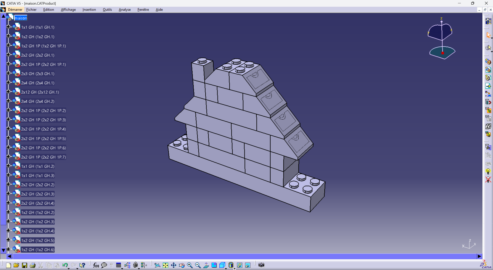

# Alexandre Perrin

Élève-ingénieur — Conception mécanique & Systèmes embarqués

---

## À propos

Élève-ingénieur en dernière année à l’ENIB, passionné par :
- l’aéronautique,
- les systèmes embarqués,
- la conception mécanique,
- le prototypage rapide,
- et l’innovation technologique.

---

## Projets

## Projet de construction LEGO sous CATIA

Projet personnel de modélisation et de reproduction de structures LEGO sous CATIA V5.

### Objectifs
- Modélisation 3D de composants LEGO
- Gestion d’assemblages sous CATIA
- Compréhension des contraintes et de la construction modulaire
- Développement des compétences CAO à travers des projets créatifs

Ce projet m’a permis d’améliorer ma compréhension de la logique d’assemblage en CAO,
du positionnement des pièces et de l’organisation de structures complexes,
tout en combinant outils d’ingénierie et conception créative.

---

### Voilier autonome

Développement d’une plateforme de voilier autonome intégrant :
- STM32,
- systèmes embarqués,
- impression 3D,
- prototypage rapide.

---

### Système de contrôle moteur STM32

Développement d’un système embarqué de contrôle moteur comprenant :
- commande PWM,
- gestion d’encodeur,
- régulation PID,
- communication UART.

---

## Expérience professionnelle

### ArianeGroup

Stage assistant ingénieur :
- conception CAO,
- coordination technique,
- systèmes d’essais aéronautiques,
- prototypage par impression 3D.

---

## Contact

- LinkedIn :
  https://www.linkedin.com/in/alexandre-perrin-5253bb1b0/

- Email :
  alexandreperrin555@gmail.com
