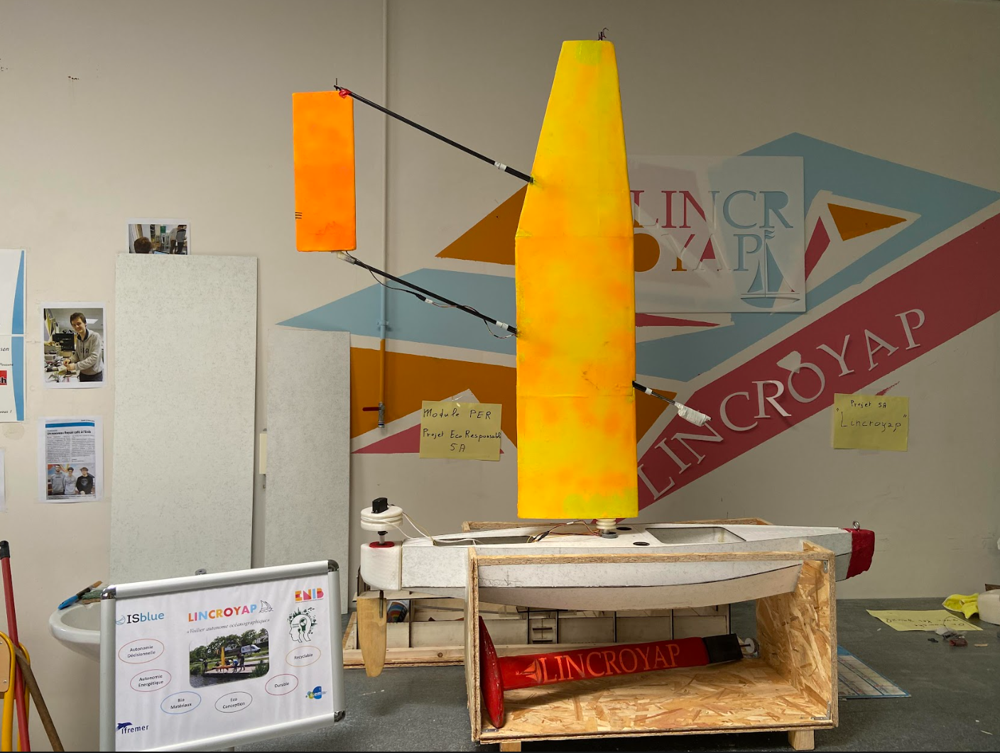

# Alexandre Perrin

Engineering Student — Mechanical Design & Embedded Systems

---

## About Me

Final-year engineering student at ENIB passionate about:
- aerospace,
- embedded systems,
- mechanical design,
- rapid prototyping,
- and engineering innovation.

---

## Projects

## LEGO CAD Construction Project

Personal project focused on recreating LEGO structures using CATIA V5.

### Objectives
- 3D modeling of LEGO components
- Assembly management in CATIA
- Understanding of constraints and modular construction
- Development of CAD skills through creative projects

This project allowed me to improve my understanding of CAD assembly logic,
part positioning and complex structure organization while combining engineering
tools with creative design.

### Autonomous Sailboat
Development of an autonomous sailboat platform using:
- STM32,
- embedded systems,
- 3D printing,
- rapid prototyping.

---

### STM32 Motor Control
Embedded motor control system with:
- PWM,
- encoder feedback,
- PID regulation,
- UART communication.

---

## Professional Experience

### ArianeGroup
Assistant Engineering Intern:
- CAD design,
- technical coordination,
- aerospace testing systems,
- 3D printed prototypes.

---

## Contact

- LinkedIn:
  https://www.linkedin.com/in/alexandre-perrin-5253bb1b0/

- Email:
  alexandreperrin555@gmail.com
